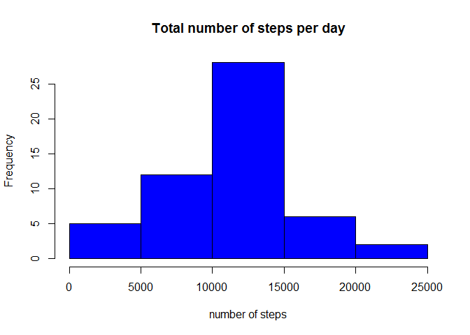
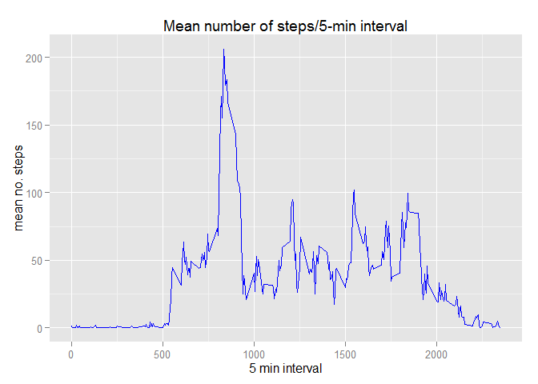
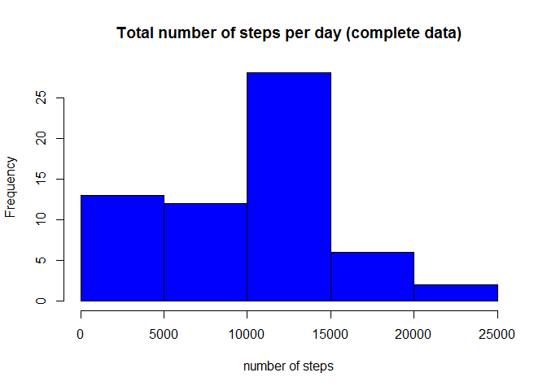
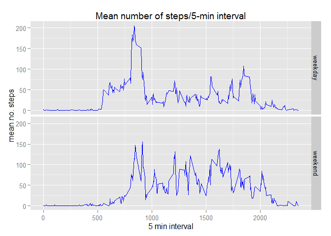

# Reproducible Research: Peer Assessment 1
This assignment makes use of data from a personal activity monitoring
device. This device collects data at 5 minute intervals through out the
day. The data consists of two months of data from an anonymous
individual collected during the months of October and November, 2012
and include the number of steps taken in 5 minute intervals each day.

**Loading and preprocessing the data**


```r
#set working directory and load required packages
setwd("~/GitHub/RepData_PeerAssessment1")
library(dplyr)
library(ggplot2)
library(knitr)
knitr::opts_chunk$set(echo=TRUE, warning=FALSE, message=FALSE)
options(scipen=999) #disable scientific notation

#Read data file

unzip("activity.zip")
data<-read.csv("activity.csv", header = TRUE,sep=",",
        stringsAsFactors=FALSE)
```

**What is mean total number of steps taken per day?**

Make a histogram of the total number of steps taken each day

```r
#Remove missing values from data set.
subdata<-na.omit(data)

#Calculate the total number of steps/day each day
dailytotal<-subdata %>%
        group_by(date) %>%
        summarise(total=sum(steps))

#Plot a histogram of the total steps taken
hist(dailytotal$total,col="blue", border="black",main="Total number of steps per day",xlab="number of steps")
```

 

Calculate and report the **mean** and **median** total number of steps taken per day

```r
# Calculate the mean and median of the total steps taken each day

ave<-round(mean(dailytotal$total), digit=0)
med<-round(median(dailytotal$total),digit=0)
```

The **mean** total number of steps taken each day is **10766**.
The **median** total number of steps taken each day is **10765**. 
 
**What is the average daily activity pattern?**

Plot the average number of steps taken for each 5 minute interval across all days.

```r
#Calculate the mean number of steps for each 5 minute interval
meansteps<-subdata %>%
        group_by(interval) %>%
        summarise(ave=mean(steps))

#Plot the mean number of steps for each interval
g<-ggplot(meansteps,aes(interval,ave))
        g+geom_line(color="blue")+
        labs(x="5 min interval")+
        labs(y="mean no. steps")+
        labs(title="Mean number of steps/5-min interval")
```

 

```r
#Find the 5-min interval with the maximum mean number of steps
ordered<-arrange(meansteps,desc(ave))
max<-ordered[1,]
m<-round(max$ave,digit=0)
i<-max$interval
```

Which 5-minute interval, on average across all the days in the dataset, contains the maximum number of steps?

The maximum average number of steps is **206** which corresponds to interval **835**. 


**Imputing missing values**

Determine the number of rows with missing values, "NA".

```r
#Determine the number of rows with missing values
x<- sapply(data$steps, function(x) sum(is.na(x)))
missing<-sum(x)
```

There are **2304** rows with missing values in the data set.

Create a new dataset that is equal to the original dataset but with the missing data filled in.
Make a histogram of the total number of steps taken each day and Calculate and report the **mean** and **median** total number of steps taken per day

```r
#The median values for each interval will be used to replace the missing values (NA) in the data set.

interval=unique(data$interval)

filled_data=data

for(i in interval){ 
        filled_data$steps[which(is.na(filled_data$steps) & 
                filled_data$interval==i)] <-
                median(filled_data[filled_data$interval==i,c("steps")],na.rm=TRUE)}

#Calculate the total number of steps/day each day
totalcomplete<-filled_data %>%
        group_by(date) %>%
        summarise(total=sum(steps))

#Plot a histogram of the total steps taken
hist(totalcomplete$total,col="blue", border="black",main="Total number of steps per day (complete data)",xlab="number of steps")
```

 

```r
# Calculate the mean and median of the total steps taken each day
ave2<-round(mean(totalcomplete$total), digit=0)
med2<-round(median(totalcomplete$total),digit=0)
```

What is the impact of imputing missing data on the estimates of the total daily number of steps?

The **mean** and **median** values for the complete data set are, **9504**, and, **10395**, respectively.  Replacing the missing data with the median value for each 5-min interval, increased the number(frequency) of days with a lower total steps/day (compare 0-5000 steps/day range between the two histograms) therefore lowering the mean and median for the full data set.

 

**Are there differences in activity patterns between weekdays and weekends?**

Compare the activity patterns between weekday days and weekend days for the full data set.


```r
#create a new data set
days=filled_data

#Add a variable (day) for days of the week.
days$day <- weekdays(as.Date(days$date))

#Classify the day as weekday or weekend

weekday=c("Monday","Tuesday","Wednesday","Thursday","Friday")
weekend=c("Saturday", "Sunday")

days$day[which(days$day %in% weekday)]<-"weekday"
days$day[which(days$day %in% weekend)]<-"weekend"

#Calculate the ave number of steps/weekday or weekend 5-min interval.       
mnsteps<-days %>%
        group_by(day,interval) %>%
        summarise(ave=mean(steps))

#Plot the mean number of steps for each interval for weekday and weekend
z<-ggplot(mnsteps,aes(interval,ave))
        z+geom_line(color="blue")+
        facet_grid(day~.)+
        labs(x="5 min interval")+
        labs(y="mean no. steps")+
        labs(title="Mean number of steps/5-min interval")
```

 
